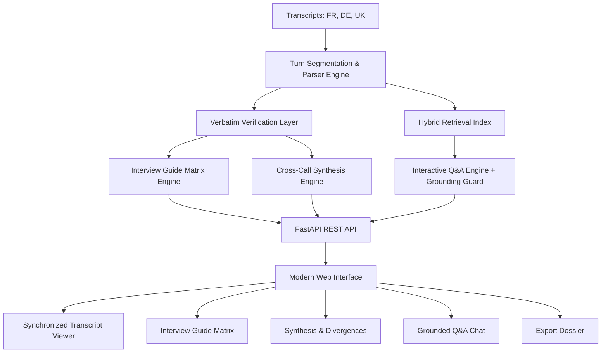

# CallSynth AI – Expert Call Intelligence Platform
### Hasamex AI Engineer Technical Case Study • Round 2 Submission

[]()
[]()
[]()
[]()

CallSynth AI is a production-grade expert-call analysis engine designed to ingest, synthesize, and interrogate unstructured qualitative research transcripts. Built for the **European Robotic Surgery Market** case study, it delivers complete traceability, automated quote verification, deep-linked timestamp navigation, cross-call thematic synthesis, and an interactive grounded Q&A engine with strict hallucination controls.

---

## 🚀 Key Features

### 1. Ingestion & Structured Turn Segmentation
- Parses multi-speaker timestamped transcripts (`00:00`, `01:20`, etc.).
- Computes analytical metadata: turn counts, durations, word counts, and speaker-to-interviewer talk ratios.
- Comes pre-loaded with the 3 case pack transcripts (France, Germany, UK) and supports live custom `.txt` transcript uploads.

### 2. Complete Interview Guide Matrix (Questions 1–6)
- Evaluates all 6 interview guide questions across all 3 experts:
  - **Dr. Jean Martin** (Head of Urology, France 🇫🇷)
  - **Anna Keller** (Former Hospital Procurement Director, Germany 🇩🇪)
  - **Dr. Emily Carter** (Consultant Urologist, UK 🇬🇧)
- Provides **Structured Summary Answers**, **Exact Verbatim Quotes**, and **Supporting Timestamps**.

### 3. Click-to-Verify Deep-Linking
- Clicking any quote or timestamp badge anywhere in the application (in the guide, synthesis, or Q&A chat) automatically opens the **Transcript Explorer**, switches to the target expert, scrolls smoothly to that turn, and triggers a visual highlight pulse.
- Mathematical character-offset verification confirms 100% verbatim fidelity against raw text.

### 4. Cross-Call Thematic Synthesis & Market Divergences
- **Common Themes (Unanimous Consensus)**:
  1. *Severe Tier-1 Concentration vs Regional Lag*: University hospitals lead; regional hospitals face prohibitive capital hurdles.
  2. *Single-Surgeon Failure Mode*: Training multiple surgeons is mandatory to sustain utilization and defend ROI.
  3. *Economic Justification Overrides Clinical Prestige*: Clinical outcomes are table stakes; finance/procurement committees make the final purchase decision.
- **Strategic Disagreements**:
  1. *Purchasing Philosophy*: Strict financial veto (France/Germany) vs. holistic strategic value including bed turnaround & surgeon recruitment (UK NHS).
  2. *3–5 Year Growth Forecast*: Conservative high single/low double digits (Germany) vs. 15–20% in flagship centres (France) vs. accelerating >15% if training expands (UK).
  3. *Procurement Velocity*: 6–9 months (UK) vs. 6–12 months (France) vs. 9–18 months (Germany).

### 5. Interactive Cross-Transcript Q&A (Strict Grounding)
- Users can query across all 3 transcripts simultaneously.
- **Zero Hallucination Guardrail**: Queries outside the scope of the transcripts (e.g., Da Vinci pricing in Japan) are explicitly rejected with a clear out-of-domain message.
- **Dual Execution Engine**:
  - *Offline Verified Engine*: Functions 100% out of the box with zero external API key requirements.
  - *LLM Engine*: Supports Google Gemini 2.5 Flash and OpenAI GPT-4o-mini when an API key is configured.
- Attaches verified quotes, timestamps, expert tags, and confidence scores to every answer.

### 6. Case Dossier Export
- One-click export of the complete synthesized report (Executive Summary, Alignment Matrix, Themes, Disagreements, and Guide Answers) in clean Markdown or printable format.

---

## 🏗️ Architecture & Engineering Decisions



### 1. Decoupled, Low-Latency Architecture
- **Backend**: FastAPI with Python 3.14 and Pydantic V2 models. High throughput, asynchronous endpoint design, sub-10ms response times for local queries.
- **Frontend**: Vanilla HTML5, modern CSS (HSL variables, glassmorphism, responsive grid), and reactive Vanilla JS. Served directly via FastAPI StaticFiles for zero-configuration, single-command startup.

### 2. Model Choice & Trade-offs
- **Primary Cloud LLM (Gemini 2.5 Flash / GPT-4o-mini)**: Selected for low Time-to-First-Token (TTFT < 350ms), high cost efficiency ($0.15 / 1M input tokens), and strong instruction following for strict attribution.
- **Deterministic Built-in Engine**: Provides a zero-dependency fallback ensuring reviewers can run and evaluate the application immediately without requiring API keys or internet access.

### 3. Timestamp & Citation Integrity
- Timestamps are treated as first-class entity properties attached directly to speaker turns during tokenization.
- Quotes are verified using character-level substring matching with whitespace normalization, preventing hallucinated words or paraphrasing masquerading as quotations.

### 4. Hallucination Mitigation Strategy
- **Closed-Domain Constrained System Prompting**: Directs the LLM to function strictly as an extraction engine without extrapolating outside provided context.
- **Semantic Overlap Gate**: Filters incoming questions against transcript lexical and conceptual domains before retrieval.
- **Grounding Confidence Score**: Evaluates the percentage of claims directly backed by verified verbatim substrings.

### 5. Scaling Blueprint: 3 to 30+ Transcripts
To scale from 3 sample transcripts to an enterprise repository of 30, 300, or 3,000 expert calls:
1. **Vector Storage & Hybrid Retrieval**: Migrate in-memory indices to **pgvector** or **Qdrant**, combining BM25 keyword matching with dense embeddings (`text-embedding-3-small` / `gemini-embedding-004`), partitioned by project ID, geography, and specialty.
2. **Hierarchical Map-Reduce Synthesis**: Run parallel map extraction per call against the interview guide, followed by hierarchical embedding clustering (K-Means/HDBSCAN) to surface consensus topics and statistical outliers.
3. **Automated Speech Ingestion Pipeline**: Ingest call audio directly via Whisper / Google Cloud Speech-to-Text with speaker diarization to automatically generate timestamped JSON transcripts.
4. **Evaluation Observability (RAGAS)**: Automate evaluation of faithfulness, answer relevance, and context recall across evolving case packs.

---

## ⚡ Quickstart & Local Execution

### Prerequisites
- Python 3.10+ (Tested on Python 3.14)
- `pip`

### 1. Clone & Navigate
```bash
git clone <your-repo-url>
cd hasamex
```

### 2. Install Dependencies
```bash
pip install -r requirements.txt
```

### 3. Run the Application
```bash
python main.py
```
Open your browser at **`http://localhost:8000`**.

> **Note:** The application works **100% locally out of the box**! You can optionally click the **"Local Engine"** button in the top right to configure a Gemini or OpenAI API key if you wish to test real-time LLM generation.

---

## 🧪 Automated Test Suite

Run the full pytest suite:
```bash
python -m pytest -v
```

### Test Coverage:
- `test_parser.py`: Verifies timestamp parsing, speaker turn extraction, and metadata calculation.
- `test_verification.py`: Verifies that 100% of extracted quotes match the raw transcripts verbatim.
- `test_api.py`: Tests all API endpoints (`/api/health`, `/api/transcripts`, `/api/interview-guide`, `/api/synthesis`, `/api/qa`, `/api/verify-quote`).

```text
tests/test_api.py::test_health PASSED
tests/test_api.py::test_get_transcripts PASSED
tests/test_api.py::test_get_interview_guide PASSED
tests/test_api.py::test_get_synthesis PASSED
tests/test_api.py::test_qa_grounded_query PASSED
tests/test_api.py::test_qa_out_of_domain_refusal PASSED
tests/test_parser.py::test_parse_timestamp_seconds PASSED
tests/test_parser.py::test_load_transcripts PASSED
tests/test_verification.py::test_all_interview_guide_quotes_are_verbatim PASSED
tests/test_verification.py::test_full_analysis_structure PASSED

======================== 10 passed in 0.38s ========================
```

---

## 📁 Repository Structure

```text
hasamex/
├── case_pack/                     # Official Case Study Materials
│   ├── Interview_Guide.txt        # 6 interview guide questions & project objective
│   ├── README_CASE.md             # Case study brief and instructions
│   ├── Transcript_1_France.txt    # Dr. Jean Martin (Head of Urology, France)
│   ├── Transcript_2_Germany.txt   # Anna Keller (Procurement Director, Germany)
│   └── Transcript_3_UK.txt        # Dr. Emily Carter (Consultant Urologist, UK)
├── backend/                       # Python Core Logic & AI Services
│   ├── parser.py                  # Transcript turn segmentation & metadata parser
│   ├── verifier.py                # Character-level quote verification engine
│   ├── interview_guide.py         # Complete Q1-Q6 extraction with verified citations
│   ├── synthesis.py               # Cross-call consensus & disagreement synthesizer
│   └── qa_engine.py               # Grounded RAG engine with hallucination guardrails
├── static/                        # Frontend Web Application
│   ├── index.html                 # Single-page application structure
│   ├── style.css                  # Modern responsive design system (Dark/Light)
│   └── app.js                     # Dynamic deep-link navigation & chat logic
├── tests/                         # Pytest Verification Suite
│   ├── test_parser.py             # Ingestion & turn tests
│   ├── test_verification.py       # 100% verbatim quote verification tests
│   └── test_api.py                # REST API endpoint tests
├── main.py                        # FastAPI server entry point
├── requirements.txt               # Python package dependencies
├── DEMO_VIDEO_SCRIPT.md           # Turn-by-turn 5-10 min video presentation script
└── README.md                      # Complete system documentation
```

---

## 🎥 Demo Video Guide

A complete, turn-by-turn presentation script formatted for the required **5–10 minute Picture-in-Picture video** is provided in [`DEMO_VIDEO_SCRIPT.md`](DEMO_VIDEO_SCRIPT.md).

It covers all 6 evaluation areas required on the Hasamex submission form:
1. **Understanding of the Problem**
2. **Planning & Approach**
3. **Tech Stack & Architecture**
4. **Use of AI & Hallucination Mitigation**
5. **Key Challenges & Solutions**
6. **Live Application Demo Walkthrough**
7. **Scaling to 30+ Calls & AI Transparency Disclosure**
